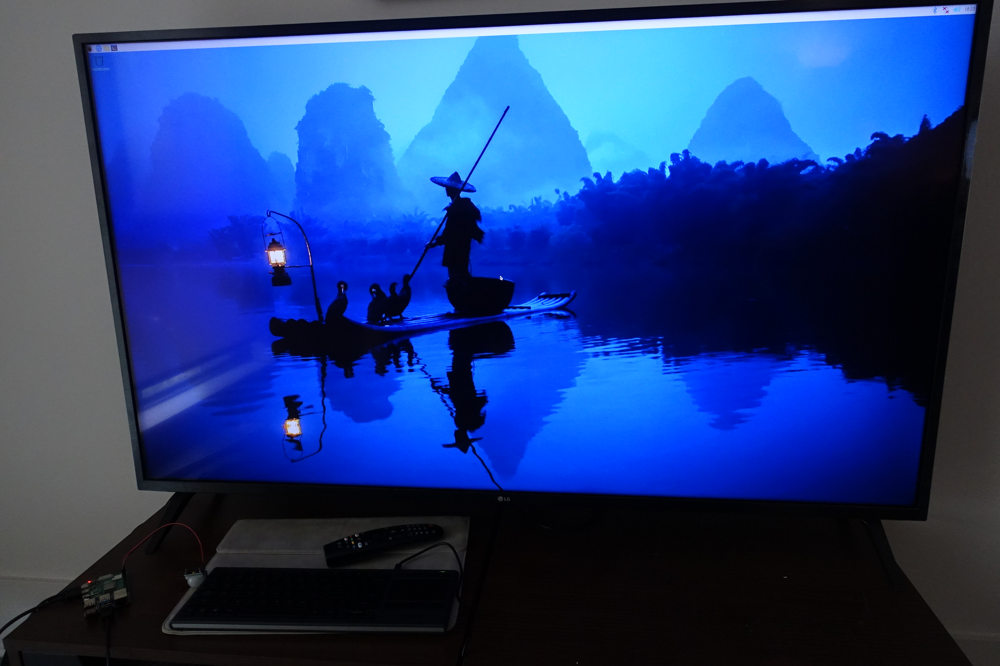
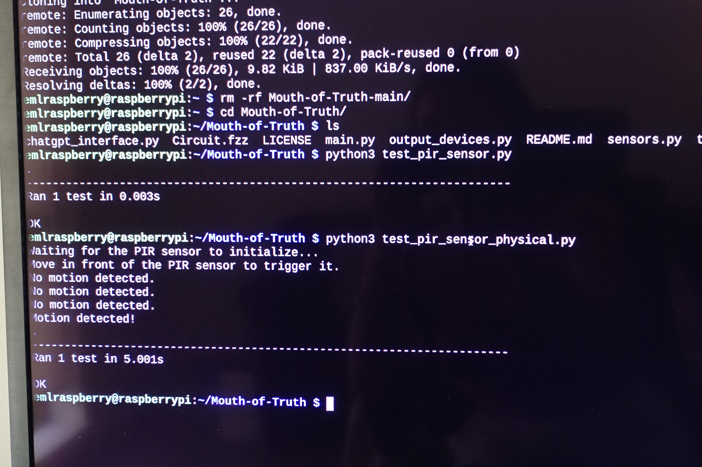

# Mouth-of-Truth

[TOC]


## Options

- [x] #### Option-1: RasperberryPi

Linux-like system can do anything.

- [ ] Option-2: Arduino + NUC Computer

**Sensors on Arduino**: 

have the Arduino manage sensors (motion detection, capacitive touch) and send a signal to the NUC when specific conditions are met (e.g., "user detected" or "hands on statue").

**NUC Responds**: The NUC computer would handle the more complex logic, like querying ChatGPT or controlling the TV and speaker, based on the signals received from the Arduino.


## Workflow

- When a user stands in front of the statue, the motion sensor activates and prepares the system to interact.

- When the user places their hands on the statue’s mouth, a response is triggered—this could involve illuminating specific LEDs or playing a sound.

- If no motion is detected for a while, the LED strip emits a slow, calming breathing light to signal the system is in standby mode.

- The user types questions via the keyboard, and the system sends the query to ChatGPT. The answer is displayed on the old TV and read aloud via the speaker.


## User Interaction Flow


| User Movement    | Device                                          | Input                                      | Output                         |
| ---------------- | ----------------------------------------------- | ------------------------------------------ | ------------------------------ |
| Stand Far Away   | "Come and ask as yes/no question"               |                                            | TV/Speaker                     |
|                  | Breathing Light                                 |                                            | RGB LED Strip with PWM control |
|                  | For detecting user proximity to the statue      | PIR Motion Sensor                          |                                |
| Put hand inside  | To detect hand placement on the statue’s mouth. | Capacitive Touch Sensor or Pressure Sensor |                                |
|                  | Light On                                        |                                            | RGB LED Strip with PWM control |
| Ask Y?N question | Light On                                        |                                            | RGB LED Strip with PWM control |
|                  | Type question                                   | Keyboard - Logitech K400 Plus              | TV                             |
| Wait             | Light blinking                                  |                                            | RGB LED Strip with PWM control |
|                  | Read out loud the answer                        |                                            | TV/Speaker                     |
| Step away        | "Come and ask as yes/no question"               |                                            | TV/Speaker                     |
|                  | Breathing Light                                 |                                            | RGB LED Strip with PWM control |
|                  | For detecting user proximity to the statue      | PIR Motion Sensor                          |                                |


## List of Components:

- [x] **Raspberry Pi 4 (with WiFi and Bluetooth)**
- [ ]  **PIR Motion Sensor (long range)**
  - For detecting user proximity to the statue.
- [ ]  **Capacitive Touch Sensor or Pressure Sensor**
  - To detect hand placement on the statue’s mouth.
- [ ]  **RGB LED Strip with PWM control**
  - For breathing light effect.
- [ ]  **Logitech K400 Plus Wireless Keyboard**
  - Mel recommend.
- [ ]  **HDMI to VGA Adapter**
  - To connect the Raspberry Pi to the old TV.
- [ ]  **USB or Bluetooth Speaker**
  - For audio output.
- [x] **HDMI Cable**
  - For connecting the Raspberry Pi to the HDMI to VGA adapter.
- [x] **VGA Cable**
  - For connecting the adapter to the old TV.
- [ ]  **OpenAI API Key**
  
- [x] **Old TV**

- [ ] **Multiple breadboard, wires, resistors**
  - For connecting sensors and motherboard
  - Probably need soldering


## Software

We could either write python or C++ with library support.

1. **A simple I/O terminal command-like GUI interface (by default)**
   - For input and output the text on TV screen
2. **Sensor Inputs**
   - Similar as Arduino, need to know GPIO layout
   - 
3. **User Inputs** (by default)
4. **ChatGPT Request**
   1. Please answer my question with yes/no, or pick from the following reasons why chatGPT can't answer those questions with yes/no (bad question). These are the bad question categories:
   2. *How would you like ChatGPT to respond?* 
      1. No information access question
      2. Time limit information question
      3. No sensor question
      4. No right or wrong answer question
      5. Dependent on Real-Time Data
      6. Requiring Personal or Contextual Information About the User
      7. Highly Subjective Questions / Personal Opinions
      8. Exact Predictions
      9. Deeply Personal Issues
      10. Medical or Legal Advice
      11. Sensory Input-Based Question
      12. Questions Involving Human Emotions or Relationships
      13. Interpretation of Art or Literature
      14. Speculative or Theoretical Queries
      15. General Knowledge and Fact Verification

4. **Display output**(sys i/o)

5. **Reading the Response Aloud**
   -  text-to-speech library
   - Different lib might sound differently, need to try and explore which one is the best


# Progress 

## Week2 (09/01-09/07)

### Pi System Ready

```shell
git clone https://github.com/RadiumLZhang/Mouth-of-Truth.git
```



### Code Structure

1. **main.py** – The main application file that handles the user interaction flow.

2. **sensors.py** – Sensor management, including PIR motion and microphone(probably need to adjust later).

3. **chatgpt_interface.py** – Manages interaction with the ChatGPT API.

4. **output_devices.py** – Controls TV display, speaker, and LED light.

5. **utils.py** – Utility functions.

```shell
sudo apt-get install python3-rpi.gpio
```

### HC-SR501 PIR Infrared Motion Sensor

  https://www.amazon.com/dp/B07KBWVJMP/?coliid=I3B5R132ZHC8H3&colid=2SPLQP9IFVO3J&psc=1&ref_=list_c_wl_lv_cv_lig_dp_it
  


### Unit Test

1. Simulated Signal ✅
```shell
python3 test_pir_sensor.py
```



2. Real Signal ✅

```shell
python3 test_pir_sensor_physical.py
```


### Circuit Connection

  **HC-SR501 PIR Motion Sensor Connection:**

  ​	•	**VCC** → Connect to Raspberry Pi’s **5V** pin.

  ​	•	**GND** → Connect to Raspberry Pi’s **GND** pin.

  ​	•	**OUT** → Connect to Raspberry Pi’s **GPIO 17**.

## Week3 (9/8-9/14)

  ### Microphone voice recognition

```shell
sudo apt-get install python3-pyaudio
pip3 install speechrecognition --break-system-packages
pip3 install pyttsx3 --break-system-packages # For text-to-speech (optional)
```

